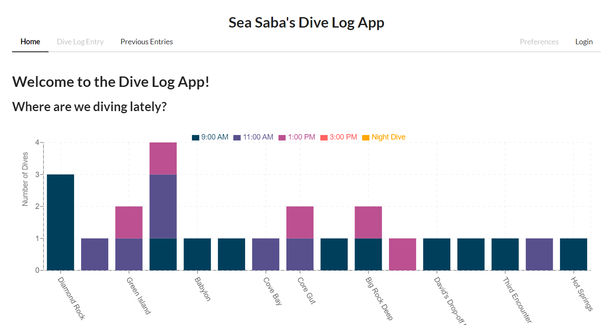
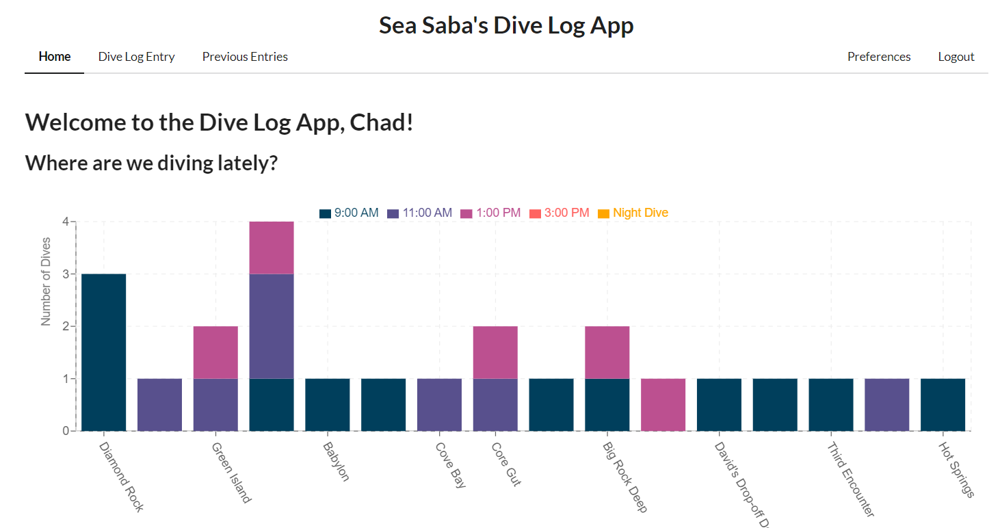
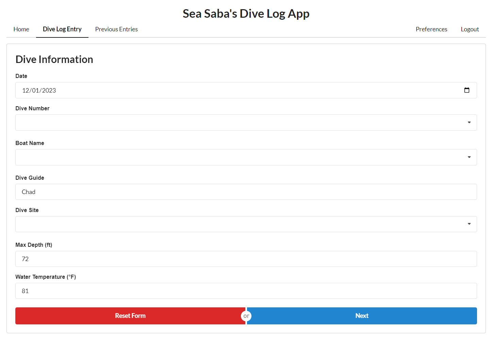
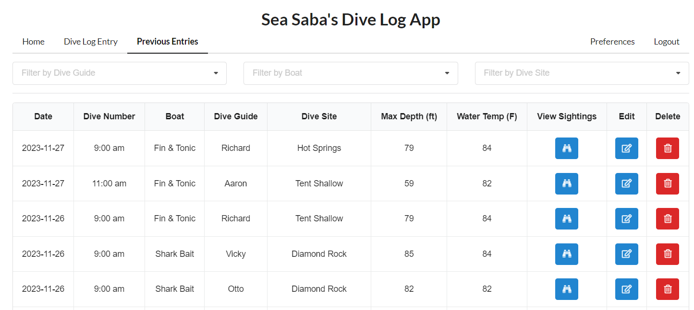
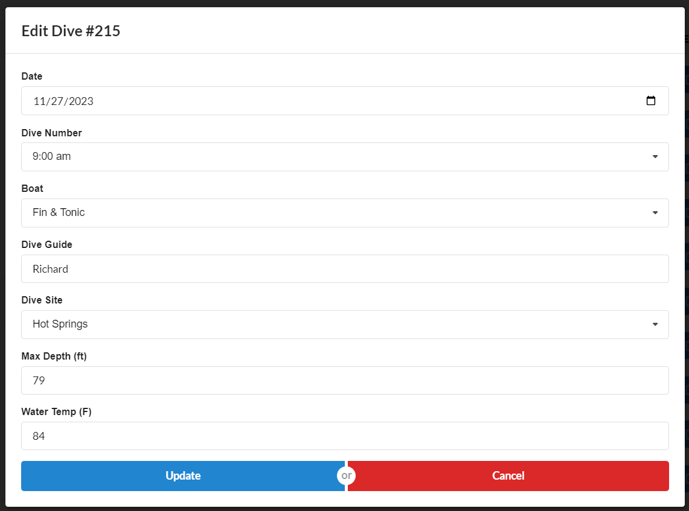
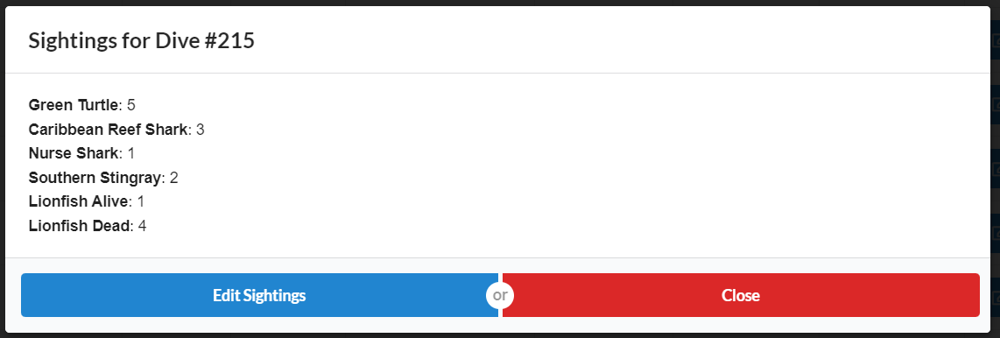
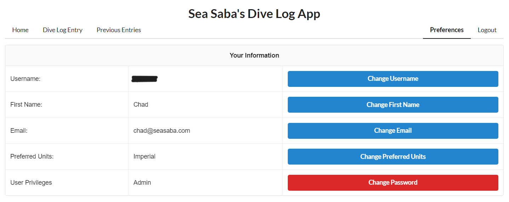

# How-To Guide: Using the Sea Saba Dive Log App

## Introduction
The Sea Saba Dive Log App is an in-house developed application designed for logging diving activities and recording sightings of specific marine species as identified by the local marine park. This guide provides detailed instructions on how to use the app effectively.

## User Registration
### Desktop
1. Click the **Login** button at the top right-hand side of the screen.
2. On the Login Page, select **Register** and follow the prompts.
3. To reset your password, use the **Reset Password** button.

### Mobile
1. Click the menu button to open the side menu.
2. Select **Login**.
3. Follow the same steps as on the desktop for registration or password reset.

Once registered, you will return to the login page to sign in.

*The home page while not logged in. Please note the greyed out buttons on the Navbar.*

## Logging a Dive
1. Log in to see the greeting message, "Welcome to the Dive Log App, [Your First Name]."
2. Click on the **Dive Log Entry** tab in the navbar.
3. Complete the multi-step form to log your dive and sightings. 
   - Note: The date and dive guide fields are pre-filled. Adjust the date for logging past dives.
4. Review your entry on the confirmation screen before finalizing.

*The home page while logged in.*

*Dive Log Entry Form.*

## Viewing Previous Entries
1. Navigate to the **Previous Entry** tab.
2. Sort entries by dive guide(s), boat(s), and dive site(s).
3. Update dive information or edit sightings as necessary.
4. Delete an entry if entered erroneously. 
   - Caution: Deletions are irreversible!

*Previous Entries*

*Editing a Dive*

*Viewing Sightings for a Dive.*

## Updating Preferences
1. Go to the **Preferences** tab.
2. Update your username, password, first name, and preferred units.
3. The app defaults to metric values but can convert to imperial units based on your preference.
   - Note: Conversion to imperial units may slightly alter the values due to rounding.

*User Preferences*

## Important Notes
- The app is designed to log only species of concern as identified by the local marine park.
- Each dive guide can log only one entry per dive site per date per dive number.
- All dive logs are displayed on our main website and the Dive Log website: [https://seasaba-divelog-frontend.onrender.com/](https://seasaba-divelog-frontend.onrender.com/).