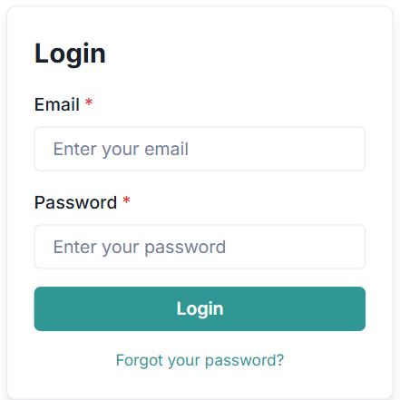
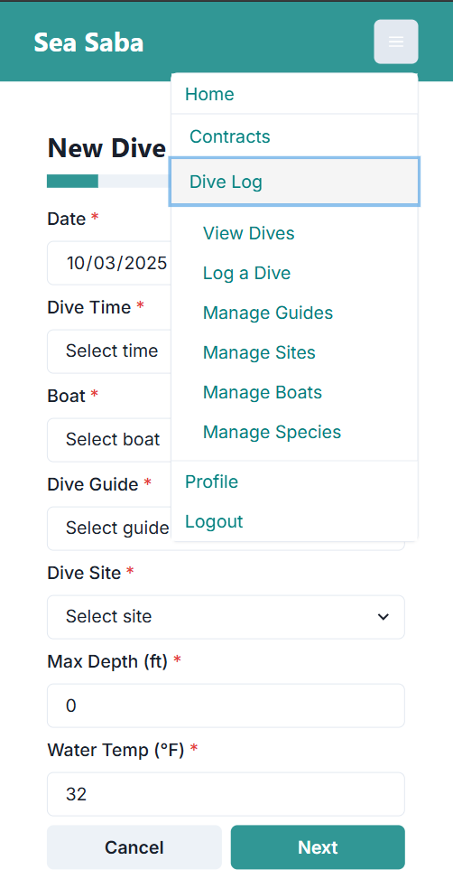

# How-To Guide: Using the Sea Saba Dive Log App

!!! alert
    **Note:** This SOP reflects the updated Dive Log app following migration. The correct link is [https://sea-saba-self.vercel.app/](https://sea-saba-self.vercel.app/). Please disregard old links.  

## Introduction
The Sea Saba Dive Log App is an in-house developed application designed for logging diving activities and recording sightings of specific marine species as identified by the Saba Marine Park. This guide provides detailed instructions on how to use the app effectively.  

## User Registration  

### Desktop  
1. Click the **Register** button at the top-right of the screen and follow the prompts.  
2. After registering, an **admin must assign privileges** before you can log dives or view entries.  
3. To reset your password, open the **Login** menu, enter your email, and click the **Reset Password** link at the bottom of the form.  

  
  
  

### Mobile  
1. Tap the menu button (three horizontal lines in the top-right).  
2. Select **Register** and follow the prompts.  
3. Use the **Reset Password** link on the login screen if necessary.  

  

## User Profile  
1. Go to the **Profile** menu.  
2. Update your name, reset your password, and set your preferred units.  
3. Your **role** is also displayed here. If it shows **“viewer”**, you will not be able to use the app — please notify an admin to update your role.  
4. The app defaults to metric units, but will convert values to imperial if selected.  

  

## Logging a Dive  
1. From the home page, click **Dive Log — Log a Dive** in the navbar, or use the **Dive Log** link on the home page.  
2. Complete the multi-step form to log your dive and sightings.  
3. Review your entry on the confirmation screen before submitting.  
⚠️ If you see **NaN** (Not a Number) in a numeric field (e.g., temperature or depth), simply type over it with the correct value.  

  

## Viewing Previous Entries  
1. From the home page, click **Dive Log — View Dives** in the navbar, or use the **View Dives** link on the home page.  
2. Sort entries by boat, dive site, dive guide, or species.  
3. Click the **Sightings** button to view species recorded for a dive.  
4. Update dive information or edit sightings as necessary.  
   - Only admins or the user who created the entry can make edits.  
⚠️ Delete an entry only if entered in error. Deletions are irreversible.  

  
  

## Important Notes  
- The app is designed to log only **species of concern** as identified by the Saba Marine Park.  
- Each dive guide can log only **one entry per dive site, per date, per dive number**.  
- All dive logs are displayed on the main Sea Saba website.  
- Notify a manager or admin if dive sites or species lists need to be updated.  
⚠️ All dives must be logged by the **end of each day**.  
