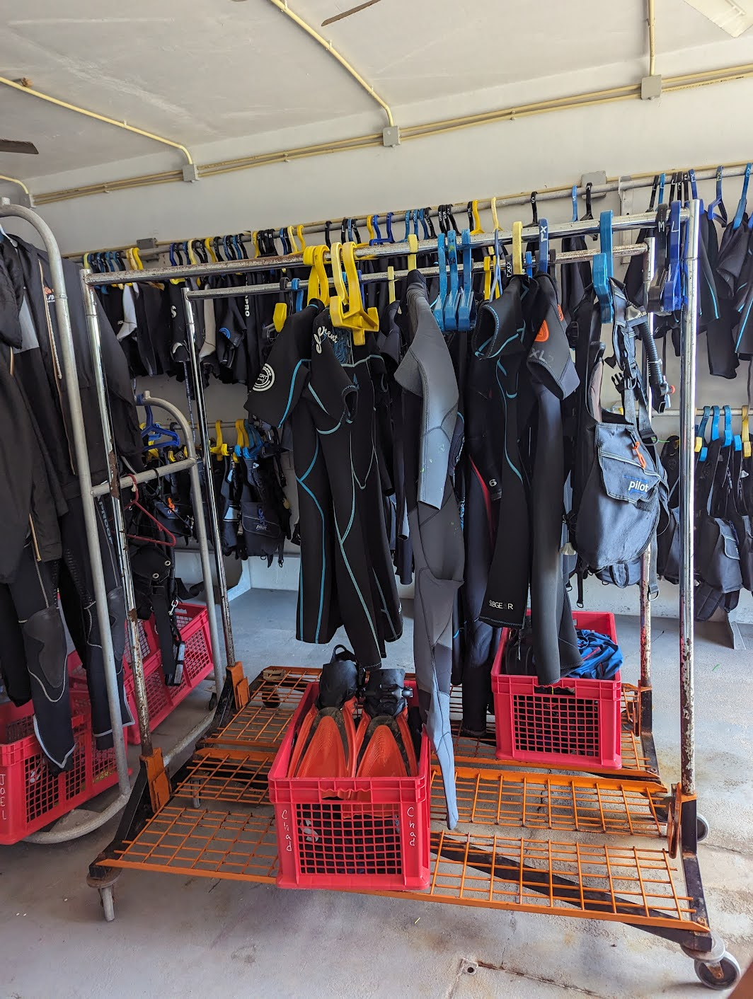
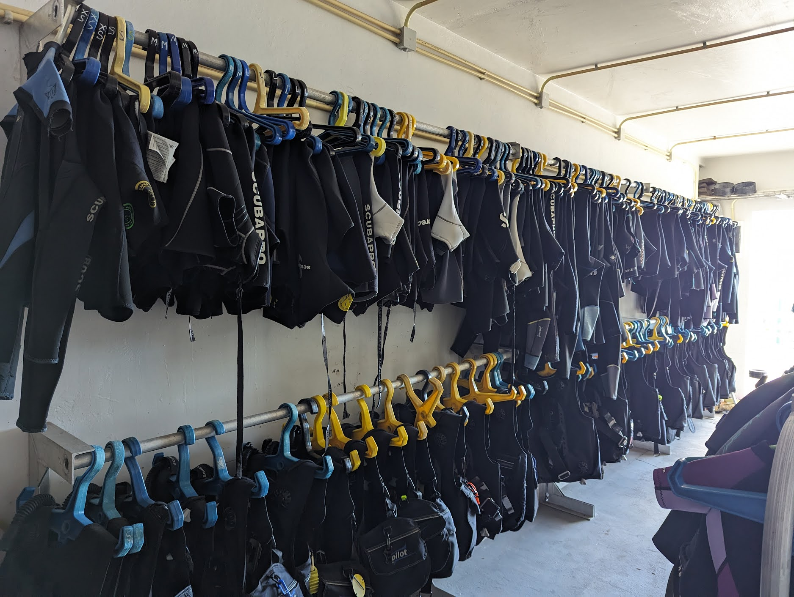
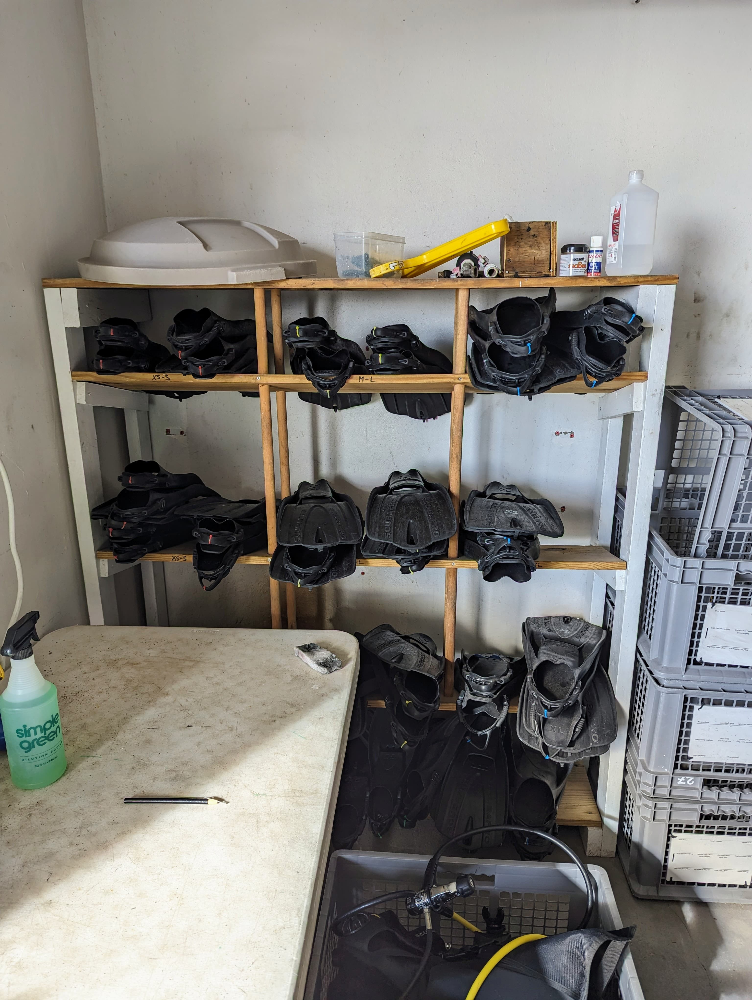
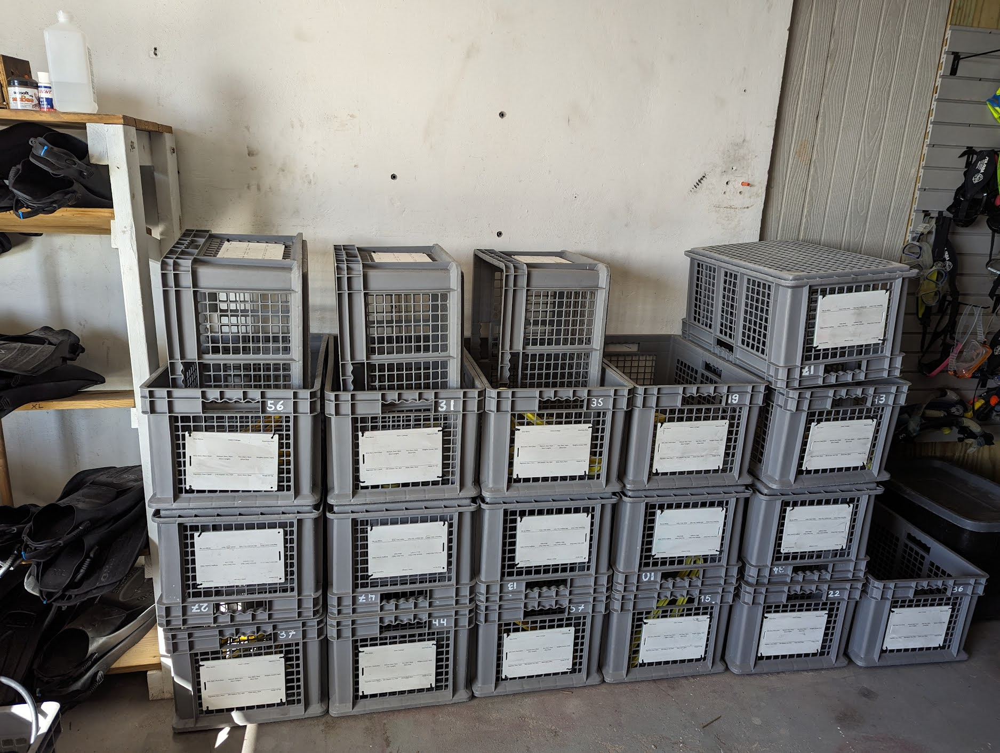

# SOP: Rinsing and Putting Away Equipment

## Purpose

The primary objective of this Standard Operating Procedure (SOP) is to establish a systematic and efficient protocol for the rinsing, inspection, and organized storage of scuba gear. By adhering to this SOP, we aim to ensure the safety, cleanliness, and readiness of scuba equipment, providing an optimal diving experience for our guests.

## Scope

This SOP encompasses the entire process of rinsing and organizing scuba gear, including wetsuits, BCDs, masks, snorkels, regulators, fins, and compasses. Additionally, it outlines the proper storage and handling of crates used in the scuba gear management process.

## Procedures

1. **Rinsing and Drying:**
    - Rinse scuba gear thoroughly, in the dunk tanks outside the equipment room.
    - Hang wetsuits and BCDs on hangers and place them on drying racks.
    - See below for rest of equipment

1. **Wetsuits:**
    - Once done drying ensure that wetsuits face the correct way and are guest-ready.
    - Find a hangar that matches the size of the wetsuit, this helps when grabbing gear for guests easier.
    - Arrange wetsuits in the following order (Starting from the back wall):
        - Men's Shortie XXS-4XL
        - Men's Long XXS-4XL
        - Women's Shortie XXS-4XL
        - Women's Long XXS-4XL
      

      
1. **BCDs (Buoyancy Control Devices):**
    - Inspect BCDs for tears or broken latches/clips.
    - Hang dry BCDs in the correct size order (Starting from the back wall):
        - Kid's
        - XXS
        - XS
        - S
        - M
        - L
        - XL
        - XXL

2. **Masks, Snorkels, and Regulators:**
    - Place in crates under the regulator hanging area, this is the to be sanitized crate.
    - Sanitization process:
          1. Soapy Water - clean masks, snorkels, and regulators to remove debris. If needed there is a toothbrush on the table to give them an extra scrub.
          2. Sanitizing - soak for 10 minutes in a designated solution.
          3. Fresh Water - rinse thoroughly and hang up on Regulator or Mask Rack.

     

1. **Fins:**
    - Inspect straps to ensure they are not worn out or breaking.
        - This inspection ensures the distribution of high-quality equipment to guests and saves time in the mornings by avoiding the need for replacement.
    - Check for size and stack them on the correct size shelves.

1. **Computers and Copmasses:**
    - Rinse in fresh water.
    - Check computers for any issues, report any issues with computers or compasses to management for timely repair.
    - Hanging up on the computer rack.

2. **Crates:**
    - Before storing, check that the crate has the correct numbered hanger.
    - If not, find the correct hanger before storing.
    - Wipe the slate clean for the next guest's use.
    - Stack crates in threes: one on the bottom, one sideways inside the bottom one, and one upside down on top.
    - Do not stack unmatched crates in the pile. Place them separately, so we can find the correct hangars.
        - **Most common places to find hangars is on the boats, or hanging on the drying racks.**

!!! note 
      **Make sure you shut off the water valve above the sink before closing up the equipment room. Otherwise it leaks all over the floor.**

## Conclusion

By diligently following this comprehensive SOP for rinsing and putting away scuba gear, we can uphold the highest standards in scuba gear management. This ensures the longevity of our equipment, the safety of our guests, and the smooth operation of our diving activities. Regular adherence to these procedures is essential for maintaining an organized and effective scuba gear handling system.

