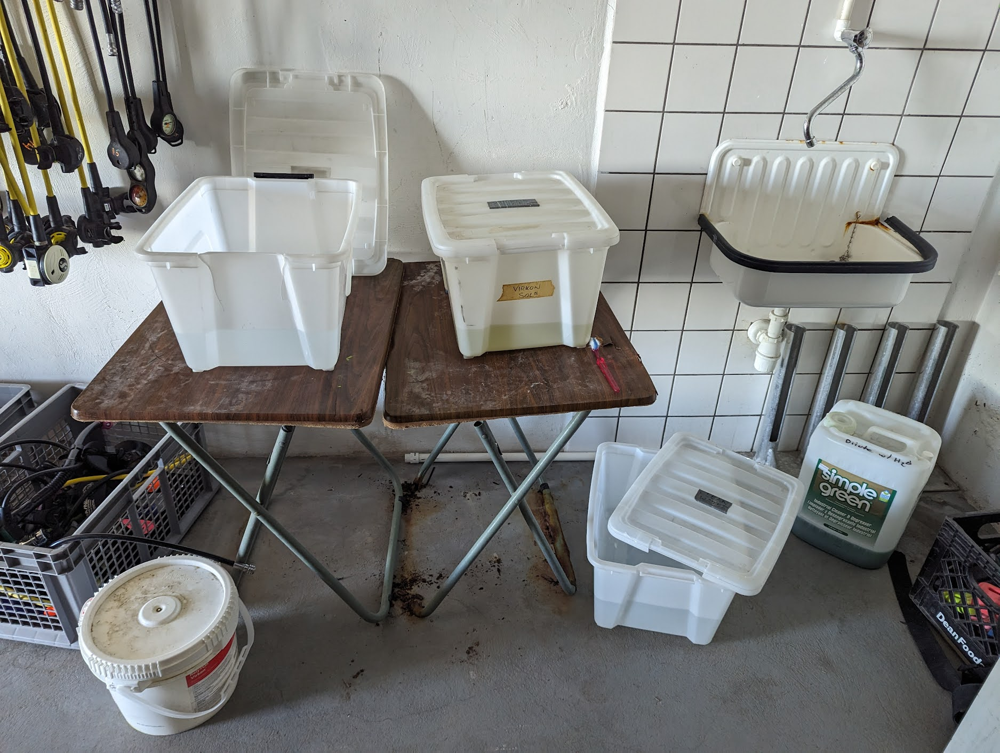
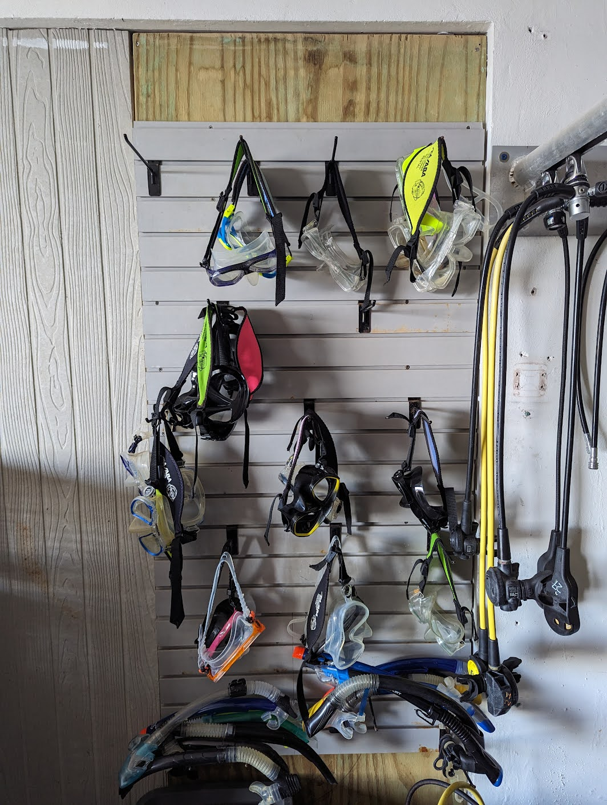
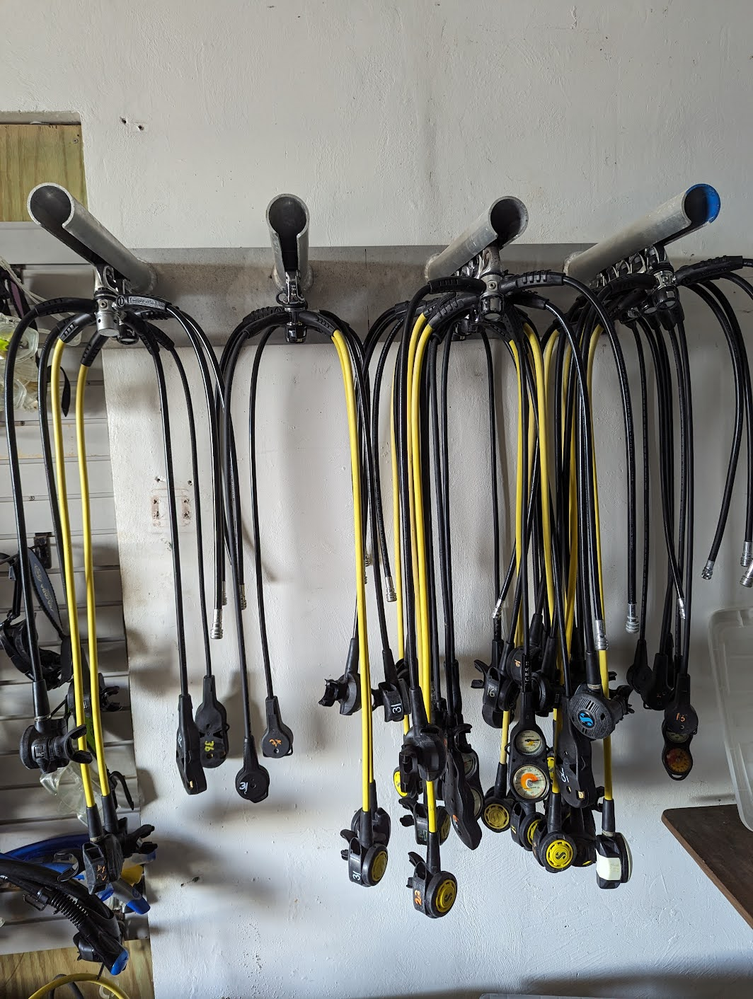
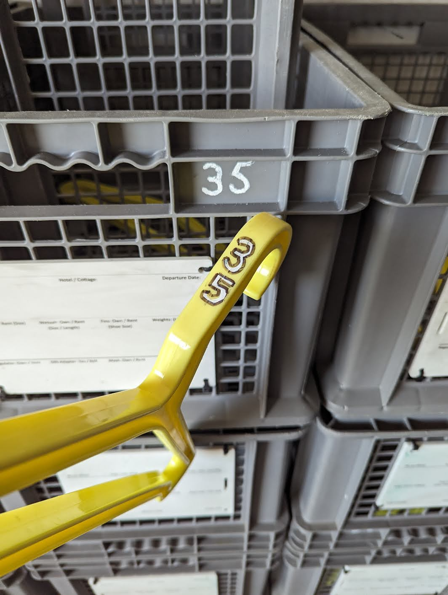

# Rinsing and Putting Away Equipment

## Purpose

To establish a systematic protocol for the rinsing, inspection, and organized storage of scuba gear, ensuring equipment safety, cleanliness, and readiness.

## Scope

This SOP applies to all dive staff responsible for post-dive equipment handling. It covers wetsuits, BCDs, masks, snorkels, regulators, fins, compasses, and crates.

## Procedure

### Rinsing and Drying

1. **Rinse all gear**: Rinse scuba gear thoroughly in the dunk tanks outside the equipment room.
2. **Hang to dry**: Hang wetsuits and BCDs on hangers and place them on drying racks.

### Wetsuits

1. **Ensure guest-ready**: Once done drying, ensure wetsuits face the correct way.
2. **Match hangers to size**: Find a hanger that matches the size of the wetsuit for easier retrieval.
3. **Arrange in order** (starting from the back wall):
    - Men's Shortie XXS-4XL
    - Men's Long XXS-4XL
    - Women's Shortie XXS-4XL
    - Women's Long XXS-4XL

### BCDs (Buoyancy Control Devices)

1. **Inspect**: Check BCDs for tears or broken latches/clips.
2. **Hang dry in size order** (starting from the back wall): Kid's, XXS, XS, S, M, L, XL, XXL.

### Masks, Snorkels, and Regulators

1. **Place in sanitize crate**: Put in crates under the regulator hanging area.
2. **Sanitization process**:
    1. **Soapy Water**: Clean masks, snorkels, and regulators to remove debris. Use the toothbrush on the table for extra scrubbing if needed.
    2. **Sanitizing**: Soak for 10 minutes in a designated solution.
    3. **Fresh Water**: Rinse thoroughly and hang up on the Regulator or Mask Rack.

### Fins

1. **Inspect straps**: Ensure they are not worn out or breaking. This saves time in the mornings by avoiding the need for replacement.
2. **Sort by size**: Check for size and stack them on the correct size shelves.

### Computers and Compasses

1. **Rinse in fresh water**.
2. **Check for issues**: Report any issues with computers or compasses to management for timely repair.
3. **Hang up** on the computer rack.

### Crates

1. **Check hanger number**: Before storing, verify the crate has the correct numbered hanger. If not, find the correct hanger before storing.
2. **Wipe the slate clean** for the next guest's use.
3. **Stack crates in threes**: One on the bottom, one sideways inside the bottom one, and one upside down on top.
4. **Do not stack unmatched crates** in the pile. Place them separately so the correct hangers can be found.

> Tip: Most common places to find hangers are on the boats or hanging on the drying racks.

!!! warning
    Make sure you shut off the water valve above the sink before closing up the equipment room. Otherwise it leaks all over the floor.

## Accountability

All dive staff are responsible for following this SOP. Regular adherence ensures the longevity of equipment, the safety of guests, and smooth diving operations.
