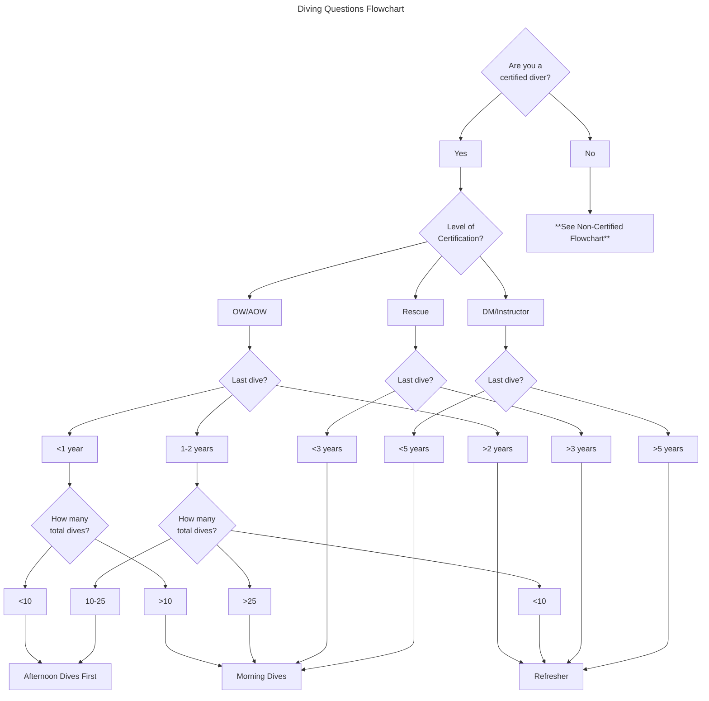

```mermaid
---
title: Diving Questions Flowchart
---
graph TD;

    AreYouCertified{Are you a<br>certified diver?} --> Yes
    AreYouCertified --> No

    Yes --> LevelOfCertification;
    No --> NonCertifiedFlowchart[**See Non-Certified Flowchart**];

    LevelOfCertification{Level of<br>Certification?} --> Ow[OW/AOW];
    LevelOfCertification --> Rescue[Rescue];
    LevelOfCertification --> PRO[DM/Instructor];
    
    Ow --> LastDiveOw{Last dive?};
    Rescue --> LastDiveRescue{Last dive?};
    PRO --> LastDivePro{Last dive?};
    
    LastDiveOw --> LastDiveOW1[<1 year]
    LastDiveOw --> LastDiveOW2[1-2 years]
    LastDiveOw --> LastDiveOW3[>2 years]

    LastDiveOW1 --> NoDivesOw1{How many<br>total dives?}
    LastDiveOW2 --> NoDivesOw2{How many<br>total dives?}
    LastDiveOW3 -----> Refresher

    NoDivesOw1 --> NoDivesAns1[<10]
    NoDivesOw1 --> NoDivesAns2[>10]

    NoDivesOw2 --> NoDivesAns3[<10]
    NoDivesOw2 --> NoDivesAns4[10-25]
    NoDivesOw2 --> NoDivesAns5[>25]

    NoDivesAns1 ---> AfternoonFirst
    NoDivesAns2 ---> MorningDives

    NoDivesAns3 ---> Refresher
    NoDivesAns4 ---> AfternoonFirst
    NoDivesAns5 ---> MorningDives

    LastDiveRescue --> LastDiveRescue1[<3 years]
    LastDiveRescue --> LastDiveRescue2[>3 years]
    
    LastDiveRescue1 -----> MorningDives
    LastDiveRescue2 -----> Refresher

    LastDivePro --> LastDivePro1[<5 years]
    LastDivePro --> LastDivePro2[>5 years]

    LastDivePro1 -----> MorningDives
    LastDivePro2 -----> Refresher
    
    AfternoonFirst[Afternoon Dives First];
    Refresher[Refresher];
    MorningDives[Morning Dives];


    class AfternoonFirst,Refresher,MorningDives green;

```
---
**These are guidelines. For further clarification, please contact the the Harbor Office.**