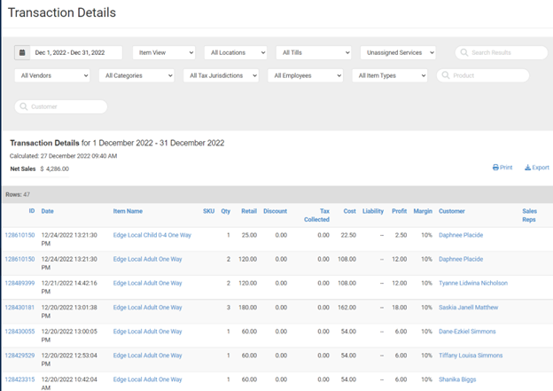
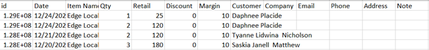
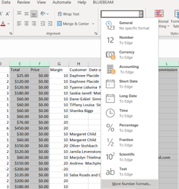
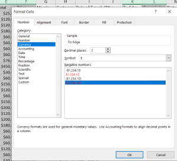
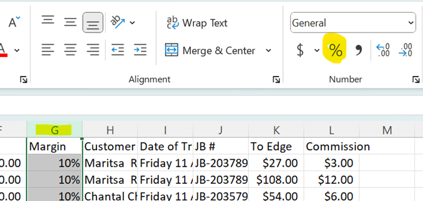
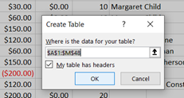
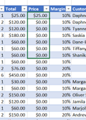
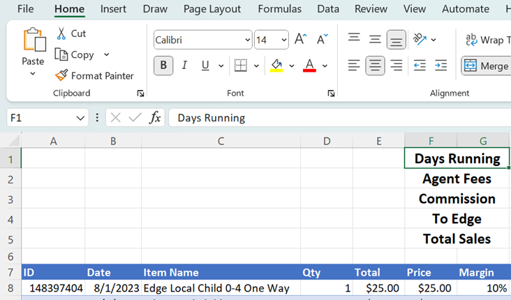
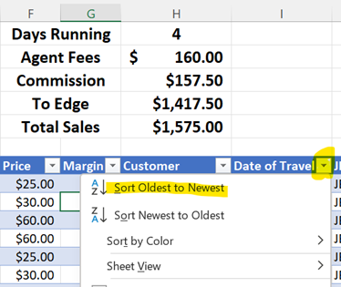

# Edge Weekly/Monthly Reports
### 1. Open up RainPOS and go to Reports
  - Select Transaction Detail
  - Select the date range that you would like to run the report for.
  - Change "All Departments" to "Unassigned Services".
  - Click Export and Open the Excel spreadsheet.

** Do not close this page you will need it later in the steps!**

### 2. On the Excel spreadsheet delete the following columns named:
  - Department
  - SKU
  - Tax Collected
  - Cost
  - Liability
  - Profit
  - City
  - State
  - Zip
  - Country
  - Serial Number
  - Store Location
  - Sales Person
  - Sales Rep

### 3. Change the column names for these to:
  - Retail change to Total
  - Discount change to Price
  - Company change to Date of Travel
  - Email change to JB#
  - Phone change to To Edge
  - Address change to Commission

### 4. Select columns (E) Total, (F) Price, (K) To Edge, and (L) Commission. Change the number format to currency.
  - Make sure to select the "More Number Formats"
  - Select the option where the negative amounts will be in  red.

### 5. Select column (G) Margin and change the number format to Percent. (You may have to change the percent back to 10% and 20% as they might go to 1000% and 2000%)

### 6. Select column (I) Date of Travel and change the number format to Short Date.

### 7. Now you will need to select all the columns and rows tht have information so that you can insert a Table.
  - Columns selected should be A - M.
  - Rows select all the way down to the last line of information.
  - Once selected, click on the Insert tab.
  - Click on the table icon.
  - Make sure that the little box is checked tht states "My Table Has Headers".
  - Click Ok.

### 8. For cell F2 enter this formula:
  - =[@TOTAL]/[@QTY] you can try copying and pasting this or....
  - Type (=), then click on the cell E2, type (/), and click on the cell D2. 
  - Once you get the formula entered, the cell (F2) should be surrounded by a green, and there will be a tiny green square in the bottom right corner of the cell. Click on the little square and drag down to the end of the table.
  - This continues the formula for the rest of the cells in that column.

### 9. In cell K2 enter this formula:
  - =[@TOTAL]-[@COMMISSION] you can try copying and pasting this or....
  - Type (=), then click on the cell E2, type (-), and click on the cell L2
  - Once you get the formula entered, the cell (K2) should be surrounded by a green, and there will be a tiny green square in the bottom right corner of the cell. Click on the little square and drag down to the end of the table.
  - This continues the formula for the rest of the cells in that column.

### 10. In cell L2 enter this formula:
  - =[@TOTAL]*[@MARGIN] you can try copying and pasting this or....
  - Type (=), then click on the cell E2, type (*), and click on the cell G2
  - Once you get the formula entered, the cell (L2) should be surrounded by a green, and there will be a tiny green square in the bottom right corner of the cell. Click on the little square and drag down to the end of the table.
  - This continues the formula for the rest of the cells in that column.

### 11. Insert 6 rows at the top of the table.
  - Select cells F1 and G1 click "Merge"
  - Repeat down to F5 and G5
  - Select cells F1/G1 to H1 down to F5/G5 and H5
      - Make these cells **BOLD**
      - Make the font size 14
  - In cell F1/G1 type: Days Running
  - In cell F2/G2 type: Agent Fees
  - In cell F3/G3 type: Commission
  - In cell F4/G4 type: To Edge
  - In cell F5/G5 type: Total Sales

### 12. In cell H2 enter this formula:
  - =H1*40

### 13. In cell H3 enter this formula:
  - =sum(L:L)

### 14. In cell H4 enter this formula:
  - =sum(K:K)

### 15. In cell H5 enter this formula:
  - =H3+H4

### 16. Sometimes in the notes column M, are the JB #'s, but not all the time.
  - If not you will need to go back to RainPOS (hopefully you still have the report open, otherwise you will need to repeat step 1)
  - For the ones missing the JB #'s you will need to click on their transactions to see if there are any in the notes.
  - If nothing in RainPOS, you will need to find them in Junglebee.

### 17. Once you have the JB #'s you will need to go to www.junglebee.com to find the date of travel.
  - Also if the customer names are missing from the spreadsheet you will need to grab them from here, and add them to the sheet.

### 18. After you have all the information filled in we will need to sort the sheet by date of travel.
  - On your table, "Date of Travel" there will be a grey box with a down arrow, click for the drop down.
  - Select "Sort Oldest to Newest".

### 19. If you still have information missing, like the customer name and or JB # you will need to get them off of AquaMania's report.

### 20. Save your report.
  - Click "Save As"
  - Select "Browse"
  - Select the following file:
      - OneDrive - Sea Saba N.V. > 08 Edge Ferry > 20XX Booking (Current Year) > XX MONTH 20XX (Current Month you are running report for).
        - If the folder for the month you are working on is not there already you will need to add a New Folder and name it.
  - Change the document from Comma Delimited .csv to Excel Workbook .xlsx
  - Change the name of the spreadsheet to XX Month (example: 08 Aug)

### 21. Once AquaMania sends their report, compare the bookings and make sure the totals match.
  - If they don't match see if there might have been a booking that we missed, or it was purchased outside the date range you ran the report for.