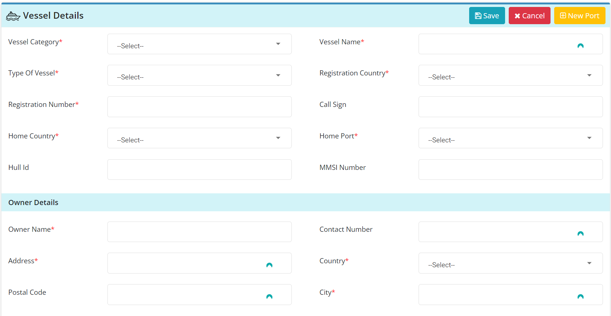
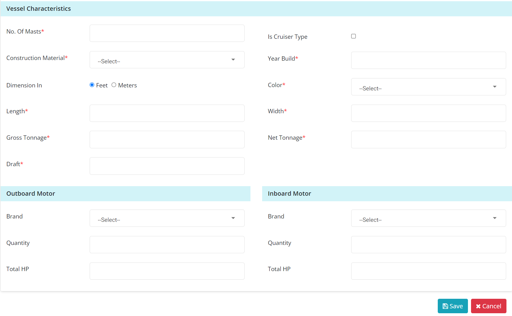
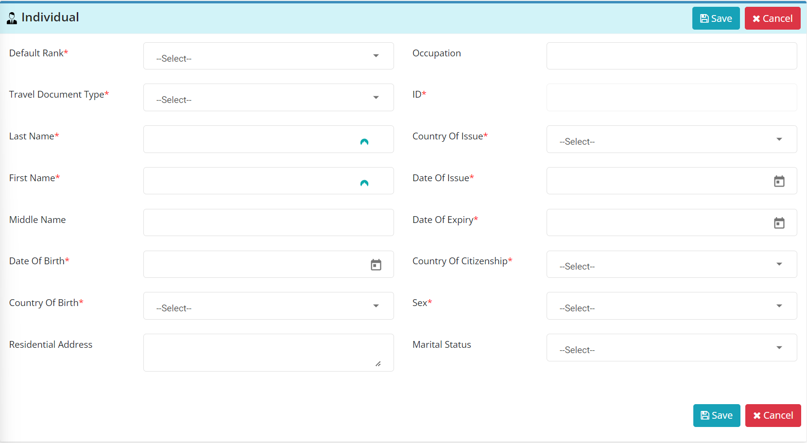
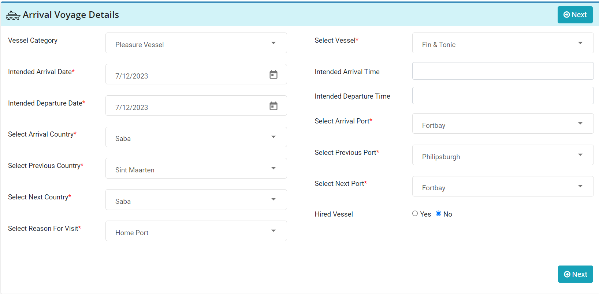
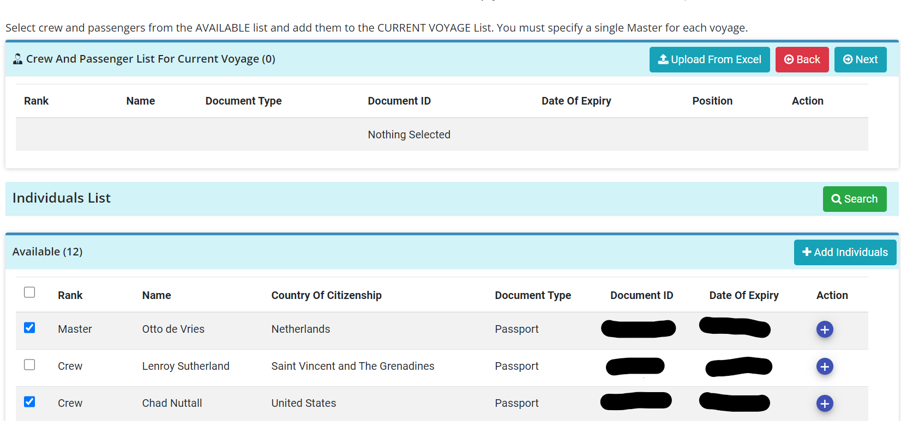
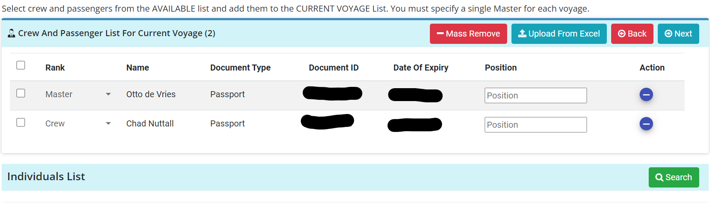
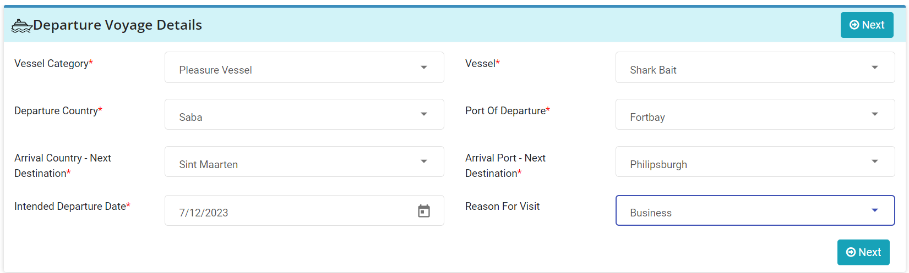

# How-To Guide: Using Sailclear for Vessel Clearance

## Purpose
To guide manager-level employees through the process of creating arrival and departure notices for Saba Customs using Sailclear.

## Scope
Applicable to employees assigned the task of clearing vessels.

## Accessing Sailclear
- **Website**: [Sailclear.com](https://sailclear.com/)
- **Initial Step**: Upon login, you land on the dashboard with instructions on starting points and creating notifications.

## Dashboard Instructions
- **Vessel, Crew, and Weapons Lists**: These need to be filled in with accurate, up-to-date details. You can not create or edit the details while completing notifications.
- **Notification Creation**: Utilize information from the lists to submit valid notifications.
- **Notification Status**: 
  - **Pending**: Can be amended at any time.
  - **Processed**: Indicates completion by Customs and other Border Agencies.

## Creating or Modifying a Vessel
1. Click on the **Vessel List** link in the navbar.
2. To add a new vessel, input the following details:
   - Vessel category, name, type, registration country and number.
   - Optional: Radio Call Sign, Hull ID, MMSI Number.
   - Owner name, address, contact number.
   - Number of masts, construction material, year built, color, dimensions, tonnage, motor information.
3. **Save**: Don’t forget to hit the save button.

## Managing Crew Members
1. Access the **Crew List** tab.
2. To add a new crewmember, input their details:
   - Rank (Master, Crew, Passenger), travel document type and details.
   - Personal information including name, date of birth, citizenship, and sex.

## Arrival Notification
1. Click on **Arrival Notification** and select **Create Notification**.
2. Fill out all required fields (marked with *).
3. For intended departure, mark the same date as arrival.
4. Next country: Saba, Next Port: Fort Bay, Reason for visit: Home Port.
5. Hired Vessel: Always select **No**.
6. Add crew and passengers from the list.
7. Complete the customs declaration (usually all answers are 'No').
8. Upon completion, note the notification ID for customs.

---

---

## Departure Notification
1. Click on **Departure Notification**.
2. Fill out voyage details including countries, ports, departure date, and reason.
3. Follow the same process as the arrival notification for the crew and passenger manifest.
4. Complete the customs declaration.
5. Note the notification ID to obtain clearance from customs.

