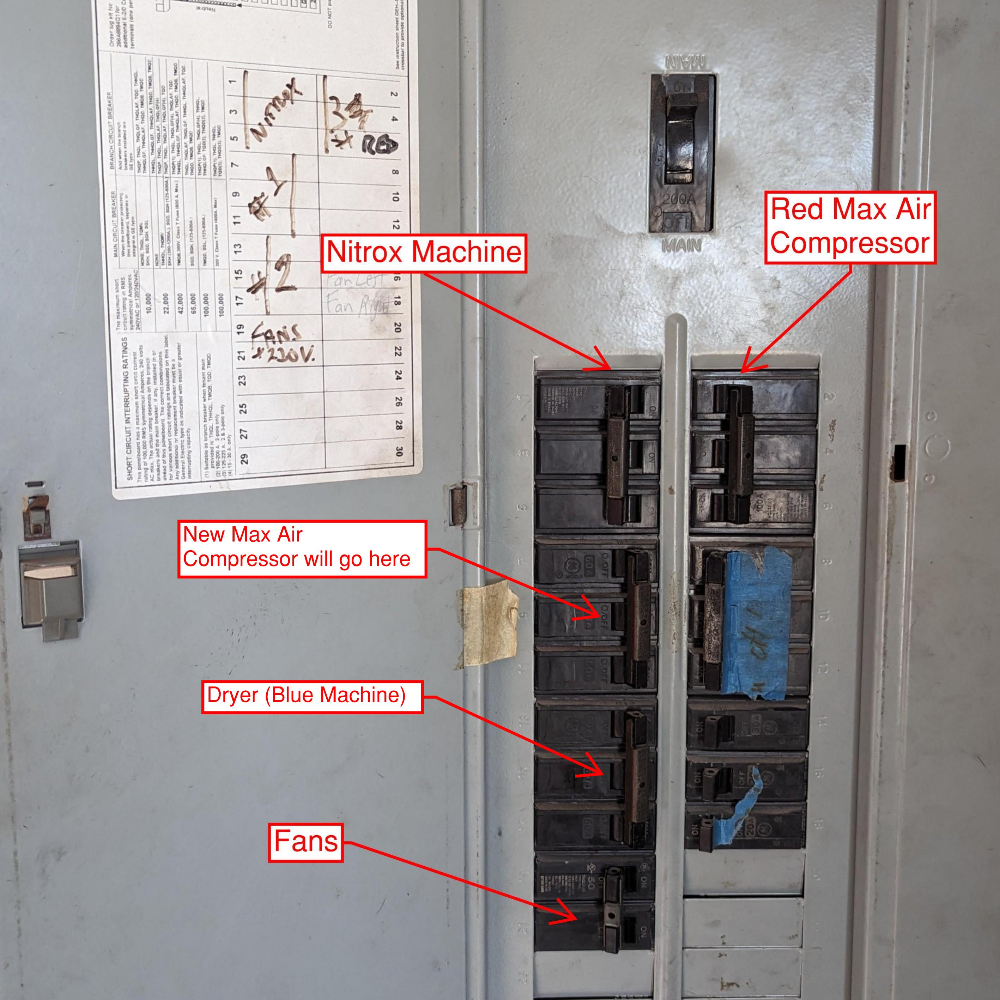
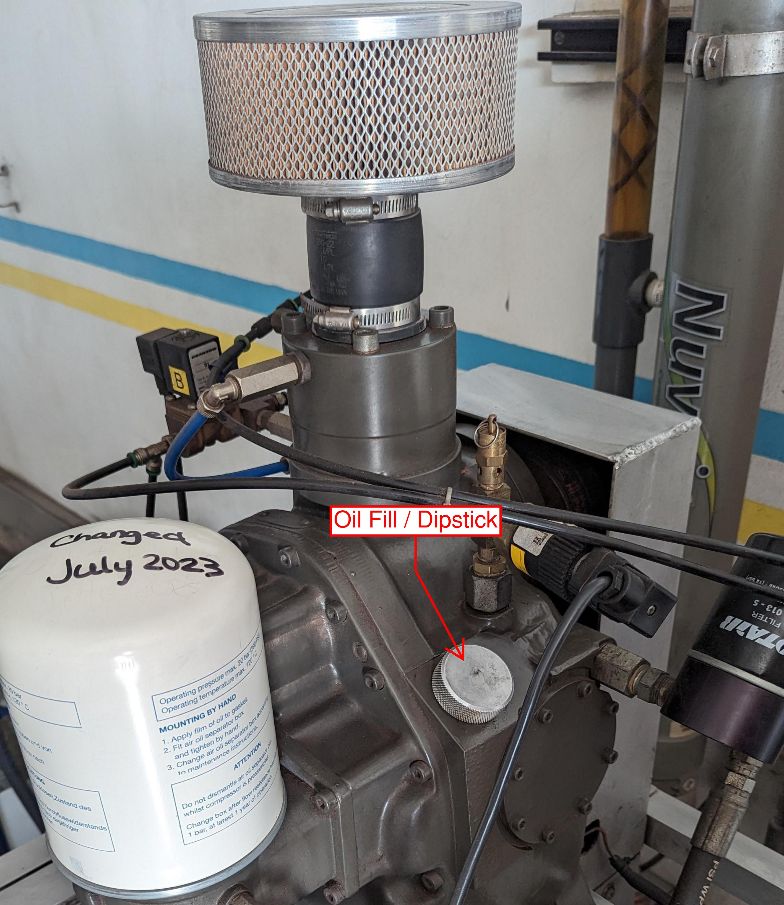

# SOP: Compressor Operations

## Purpose

The purpose of this Standard Operating Procedure (SOP) is to ensure the safe, efficient, and consistent operation of the compressors used in diving operations at Sea Saba. This SOP provides detailed instructions on operating the compressors, handling associated equipment, and performing routine maintenance tasks. It is designed to uphold the highest standards of safety and quality in our diving services.

## Scope

This SOP applies to all dive staff at Sea Saba who are involved in compressor operations. It covers the procedures for:

- Starting and operating the compressors for air and nitrox filling.
- Performing routine checks and maintenance of the compressors, including oil level checks, air filter inspection, and condensate drainage.
- Ensuring the proper arrangement and filling of diving tanks.
- Adhering to safety protocols to prevent accidents and equipment damage.

All dive staff members are required to familiarize themselves with these procedures and adhere to them strictly during their compressor room duties.

## Operational Procedure

### Turn on the Equipment:
   - Turn on the breakers for the fans and Compressor 3 (Red Max-Air) when filling air. 
   - If filling nitrox, also turn on the Nitrox breaker.
   - Plug in the heater and dryer (located behind the air dryer on the wall). 
   - Turn on the dryer (blue machine) to allow it to warm up.

### Check Air Filter and Oil Change Status:
   - Refer to the dry erase board for air filter and oil change status.
   - The Nitrox Blue Filters are tracked with the Nitrox Machine Hour meter.
   - The Red Compressor and Air Filters are tracked with the Red Compressor Hour meter.
   - Refer to [Compressor Servicing](CompressorServicing.md) for more information about changing oil and filters.

### Check Oil Levels:
   - The Red Compressor has 2 sight glasses. The oil should be approximately halfway up the top sight glass.
   - The Nitrox compressor has a screw-in dipstick. The oil should be on the hatch marks.
   - If necessary, top up the oil. The Nitrox compressor takes Nuvair 546 oil and the Red Compressor takes SecoLube Tropics. Notify if you had to top up the oil.

!!! note
      - Confirm with Management before changing oil due to being "dirty". 

### Drain Condensate:
   - Both the dryer and red compressor have bottles that collect condensate.
   - The dryer’s condensate (only water) can be emptied outside.
   - The red compressor’s condensate must be emptied into a used oil container for proper disposal.

### Wipe Down the Machines:
   - Wipe any grease and grime off every day. This makes it easier to spot maintenance issues.
   - Alert management if you spot anything of concern.

### Starting the Compressors:
   - After approximately 5 minutes of warming up the dryer, start the compressors.
   - For air filling, start directly. For Nitrox, bleed the system until the air reaches the appropriate oxygen percentage.
   - Bleeding the system is done by opening one of the fill whips to atmosphere.
   - Watch the Oxygen Sensor to monitor the Oxygen percentage. It is normal on startup for the Oxygen percentage to start around 32% before falling to near 21% and then rising again. You can start filling when the percentage exceeds 31%. 
    

!!! note
      - Target percentage is 32.3% +/-. You can adjust using the regulator on the Nitrox machine. Don't just turn the knob, look at the pressure gauge and adjust up or down as needed. More pressure = higher O2 %.
      - Ensure that the Oxygen Sensor is calibrated! This can be done by taking off the cap and setting the percentage to 20.9%

### Arrange Tanks for Filling:
   - Arrange 4/5 rows of tanks with a clear path to the control panel.
   - Stagger the tanks to allow the whips to be placed on the tanks without putting pressure on the stems.
   - Connect the fill whips to the row furthest from the wall for efficient operation.

!!! note
      - Check each tank for Hydro and Visual Inspection Status. Pull any tanks aside that are due for Hydro or Visual Inspection. Do **NOT** drain the tank unless you are going to complete the VIP that day. Do **NOT** leave tanks without pressure overnight.

### Filling Procedure Nitrox - Cascade:

   - **Duration**: 
   - Filling a row of 8 tanks using only the compressor takes approximately **20-30 minutes**.
   - Using the cascade system can reduce the filling time to as little as **4-6 minutes**, depending on fill speed. Control the speed by adjusting the bank valves.
    
#### Steps:

1. **Initial Filling**:
    - Begin filling tanks from **Bank 2** and the compressor simultaneously.
    - Allow the tanks and Bank 2 to reach equilibrium.
   
2. **Switch Banks**:
    - **Close Bank 2** before opening **Bank 1** to complete the fill.
    - If **Bank 1** is below **3300 psi**, close it after equilibrium is reached and finish topping off the tanks with the compressor.

3. **Reaching Full Pressure**:
    - Once the tanks reach full pressure (**3300 psi hot**), close the tank valve.
    - Open **Bank 1** during the switchover process.

4. **Switch Tanks**:
    - Replace the filled tanks with new ones and repeat the process.
    - If you need to step away, consider filling the banks (Note: **Bank 2** has a maximum pressure of **3000 psi**).

5. **Compressor Auto-Shutdown**:
    - The system will automatically shut off when it reaches **4500 psi**.
    - If the tanks are full and you need to restart the compressor, close the tank valves and then open the appropriate bank valve.

6. **Nitrox Compressor Behavior**:
    - The Nitrox compressor will not shut down as it continuously supplies enriched air to the high-pressure (red) compressor.

!!! alert
      - **Never open both banks simultaneously!**
!!! warning
      - **Maximum Pressure**: Be aware that the max pressure in **Bank 2** is 3000 psi with no auto shutoff. Pay close attention.
      - **Pressure Regulation**: The pressure to tanks is regulated at 3300 psi; when this is reached, the valve will close, back pressuring the system.
      - **Restarting Compressors**: If the compressor shuts down at 4500 psi, it’s OK, but avoid making it a habit. Ensure the tank valves are closed before opening the bank valve and restarting the compressor.

### Filling Procedure Air:
   - **Duration**: It takes approximately 20-30 minutes to fill a row of 8 tanks.
   - **Current System**: As of this writing, we do not have a dedicated air bank system. This is planned for expansion in **Q4 2024**.

#### Steps:

1. **Begin Filling**:
    - Line up the row of tanks and start filling. 
    - Monitor the pressure as the tanks approach **3000 psi**.

2. **Shut Off Half the Tanks**:
    - Once half of the tanks reach **3000 psi**, shut them off.

3. **Continue Filling to 3300 psi**:
    - Allow the other half of the tanks to continue filling until they reach **3300 psi**.
    - **Note**: Properly timing this will prevent the compressor from shutting off due to back pressure (4500 psi).

4. **Switch the Tanks**:
    - While the compressor is pumping the second half of the tanks to **3300 psi**, change out the first half of the tanks that were previously shut off.

5. **Repeat the Process**:
    - Once the second half of tanks reaches **3300 psi**, close them.
    - Open the new set of tanks (the first half that was replaced) and repeat the process.
    - Continue alternating until all tanks are filled to **3300 psi**.

### Shutting Down
   - The Nitrox Compressor is shut down by rotating the On / Off / Start switch to off. This will start the shutdown procedure which takes approximately 30 seconds. 
   - The Red Compressor is shut down by pressing the Off button. This shuts down immediately. 
   - Before shutting off the red compressor, it is advisable to manually open the drain valves to purge the condensate collectors. This should only take about 5 seconds each (There are 3). Ensure the knobs are fully tightened when done.
   - Turn off the Blue Air Dryer, unplug the heater and air dryer (Two plugs behind the Blue Air Dryer), turn off the O2 Analyzer and ensure the banks are closed.
   - Shut off the breakers for the Compressors and Fans.

!!! alert
     - If the banks are not closed, they will leak through the O2 analyzer overnight and drain down significantly

## Conclusion

Strict adherence to this SOP ensures the safe and efficient operation of our compressors. Your diligence and attention to detail are crucial in maintaining the high standards of Sea Saba’s diving operations.