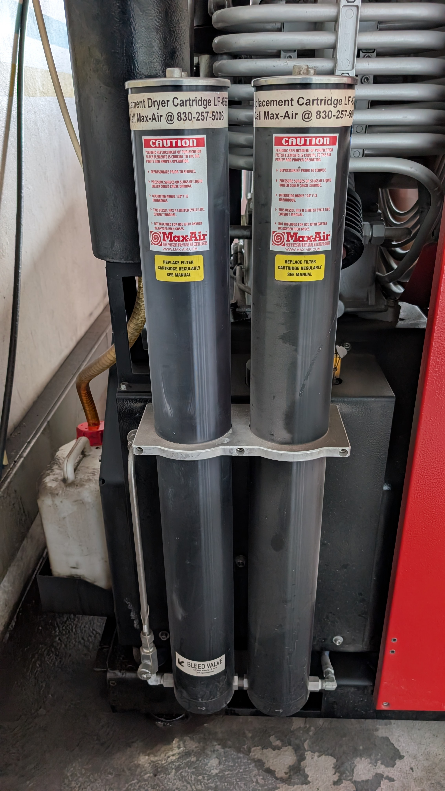
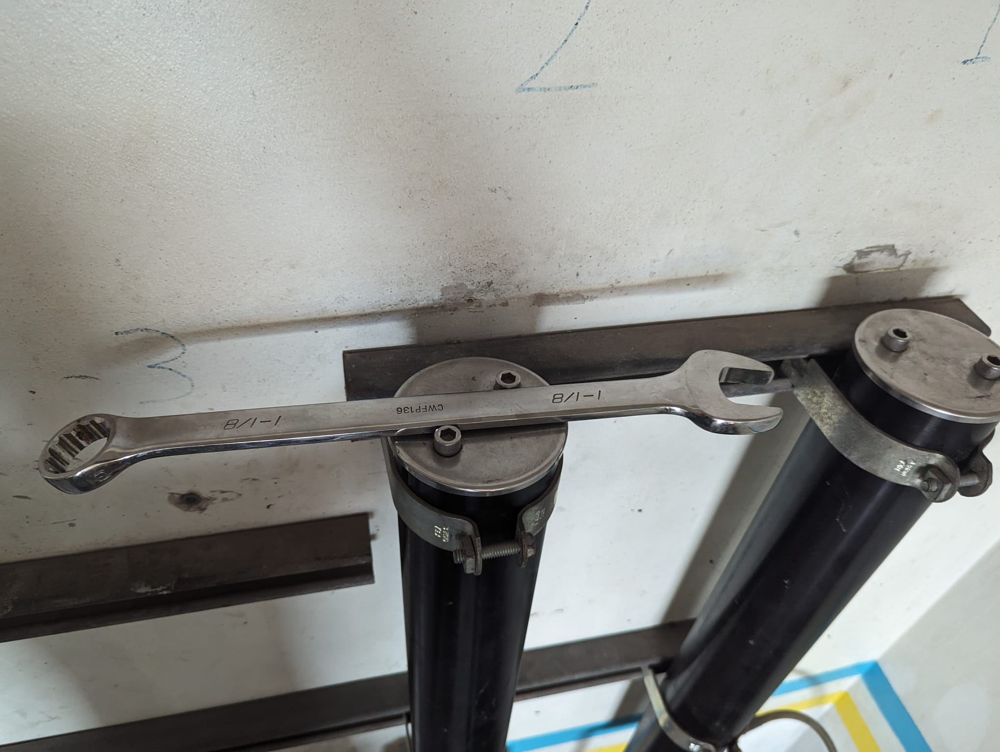
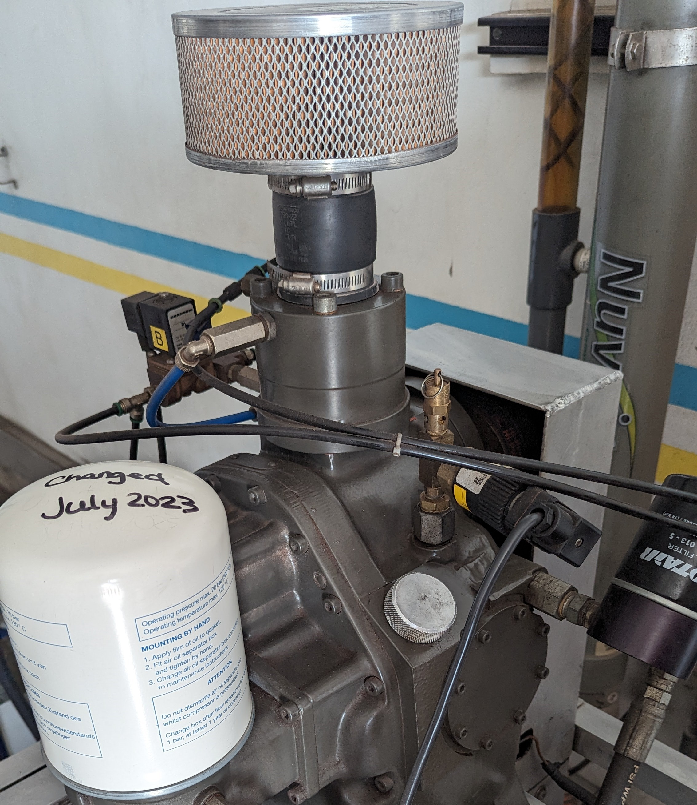
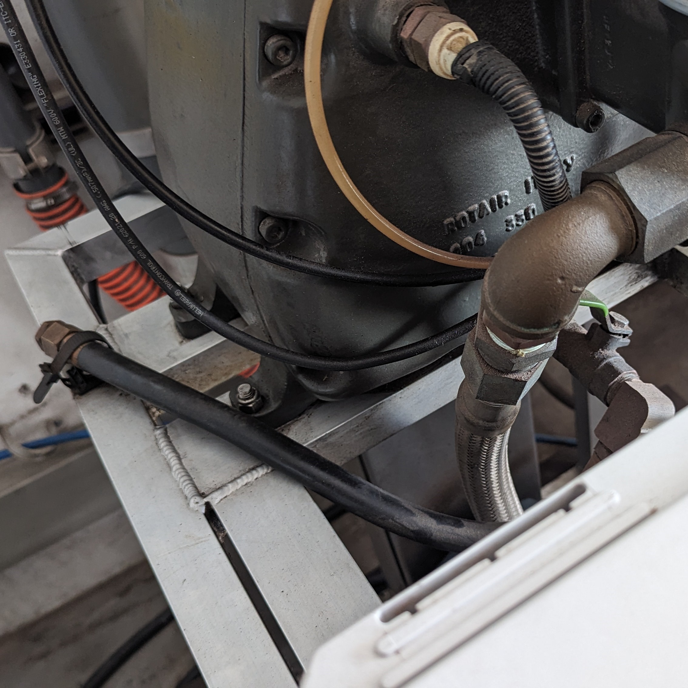
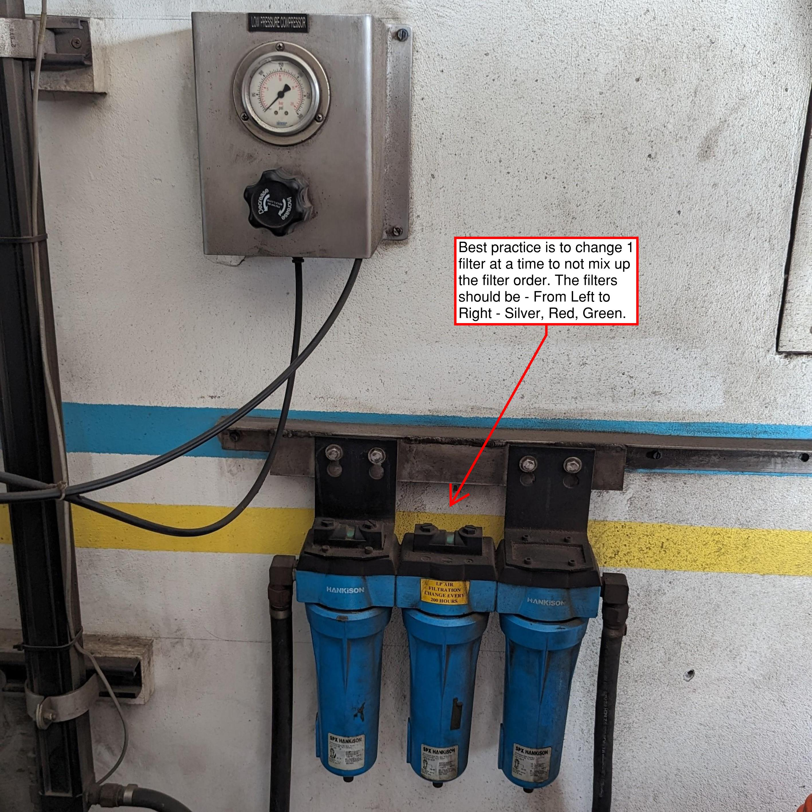

# Compressor Maintenance

## Purpose

To outline the procedures for routine maintenance of the compressors used at Sea Saba, ensuring safe and efficient operation and extending their lifespan.

## Scope

This SOP applies to all dive staff responsible for compressor maintenance. It covers air filter changes, oil changes, and other routine maintenance tasks.

## Procedure

### Final Air Filters — Compressor-Specific

#### General Configuration

Each Red Compressor now has its own dedicated two-stage final filtration assembly mounted directly to the compressor. This allows filter service intervals to be tracked independently for each machine.

Air flows through each assembly in the following order:

1. **Filter 1** (left side, closest to the wall) — drying media for moisture removal. Uses **Lawrence Factor X65677**.
2. **Filter 2** (right side) — final purification media for breathing air filtration. Uses **Lawrence Factor X65247**.

After passing through both stages, air flows to the fill panel.

#### Service Interval

- Replace both filters every **50 hours** of compressor run time.
- Filter hours for the **Old Red Compressor** (Air) and **New Red Compressor** (Nitrox) are tracked independently on the status board.

#### Filter Change Procedure

!!! danger
    Never attempt to open filter housings while the system is pressurized. Always fully depressurize and verify pressure is relieved before loosening any housing.

1. Shut down the compressor and allow it to stop completely.
2. Use the **bleed valve on the lower left side of the filter assembly** to depressurize the system.
3. Verify the system is fully depressurized before proceeding.
4. Begin loosening filter housings slowly with the appropriate wrench. If excessive resistance is felt, stop — residual pressure may remain in the system.
5. Remove and discard both old filter cartridges.
6. Clean housing threads and sealing surfaces.
7. Inspect O-rings and apply silicone grease if necessary.
8. Install new filters in the correct locations:
    - **X65677 drying filter** into the left housing (Filter 1)
    - **X65247 purification filter** into the right housing (Filter 2)
9. Reinstall housings securely. Hand-tight plus a firm snug with the wrench is sufficient — do not overtighten.
10. Return the system to service and inspect for leaks.

#### Inventory Tracking

- Notify management when filter inventory is running low.
- When new filters arrive, **mark existing inventory with an "X"** so older stock is identified and used first.

### Maintenance of the Nitrox Machine

!!! note
    Refer to the maintenance manual for detailed procedures and safety precautions before starting any maintenance tasks.

1. **Annual / 500 Hours Maintenance**:
    - Change air/oil separator annually, oil and oil filter every 500 hours.
    - Drain old oil using a suitable container.
    - Remove and replace oil filter.
    - Refill with Nuvair 546 Oil.

2. **Every 200 Hours**:
    - Change air intake filter and blue filters.
    - Note hours on new air intake filter with a marker.
    - Change blue filters sequentially:
      - Silver E7-20 (1 micron).
      - Red E5-20 (0.1 micron).
      - Green E1-20 (0.003 ppm oil vapor).
    - Inspect bowls and elements for moisture and degradation.
    - Lubricate new filter O-rings before installation.
    - Clean housing interiors before reassembly.

> The blue filters belong to the Nitrox membrane pre-filtration system and are separate from the final breathing air filters mounted on each Red Compressor.

!!! note
    Change one blue filter at a time to maintain correct order.

3. **Inventory Notification**:
    - Notify management if only one filter is remaining or if there are only two gallons of oil left.

### Maintenance of the Old Red Compressor (Air)

1. **Oil and Filter Change**:
    - Change oil and filter every 90 hours.
    - Drain oil using a suitable container.
    - Replace oil filter; keep spills to a minimum.
    - Refill with Secolube Tropics oil.

!!! note
    Hand-tighten the oil filter only to avoid difficulties in future removal.

2. **Long-Term Maintenance**:
    - Service intervals at 1000 and 2000 hours are performed by Chad.
    - Notify management when these services are due.

!!! danger
    Working with compressed gas and maintaining breathing air systems involves inherent risks. Improper handling, usage, or maintenance can lead to serious injury or death. Adhere to safety protocols:

    - Follow established SOPs and manufacturer guidelines.
    - Use correct tools and equipment.
    - Wear appropriate PPE.
    - Report any issues immediately.
    - Be familiar with emergency procedures.

## Accountability

All dive staff are responsible for adhering to this SOP. Safety and quality of air are paramount. Your diligence in maintenance is crucial for safety and operational efficiency.
