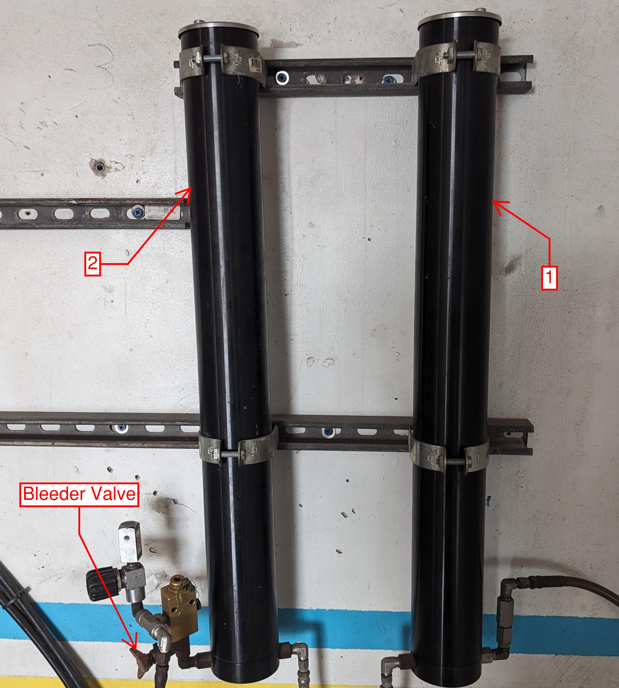
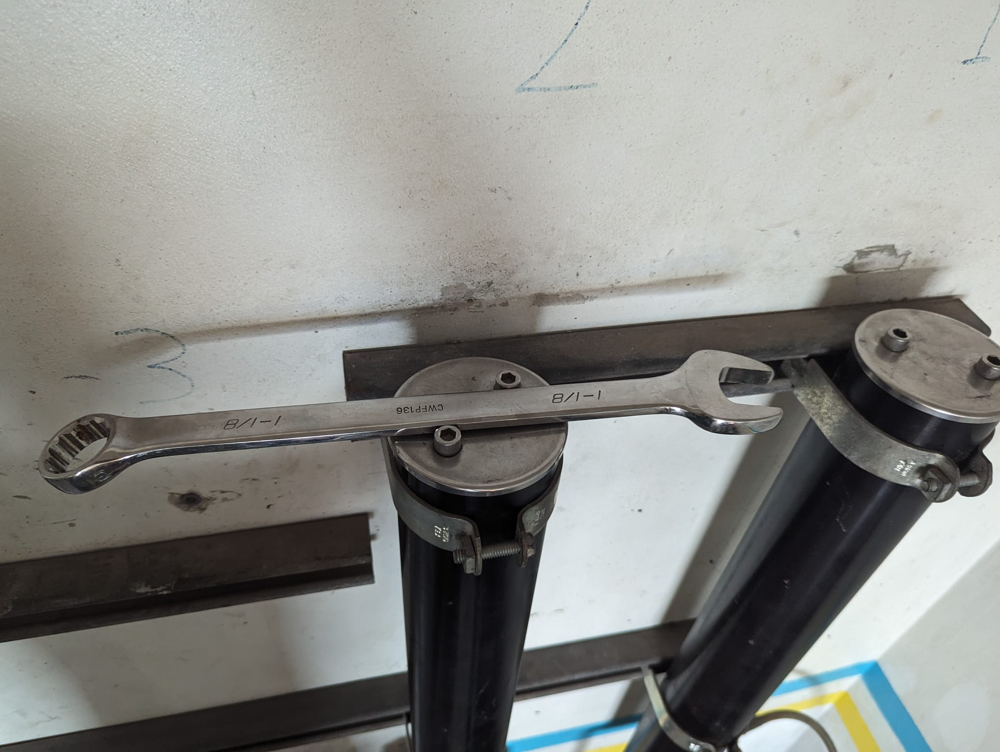
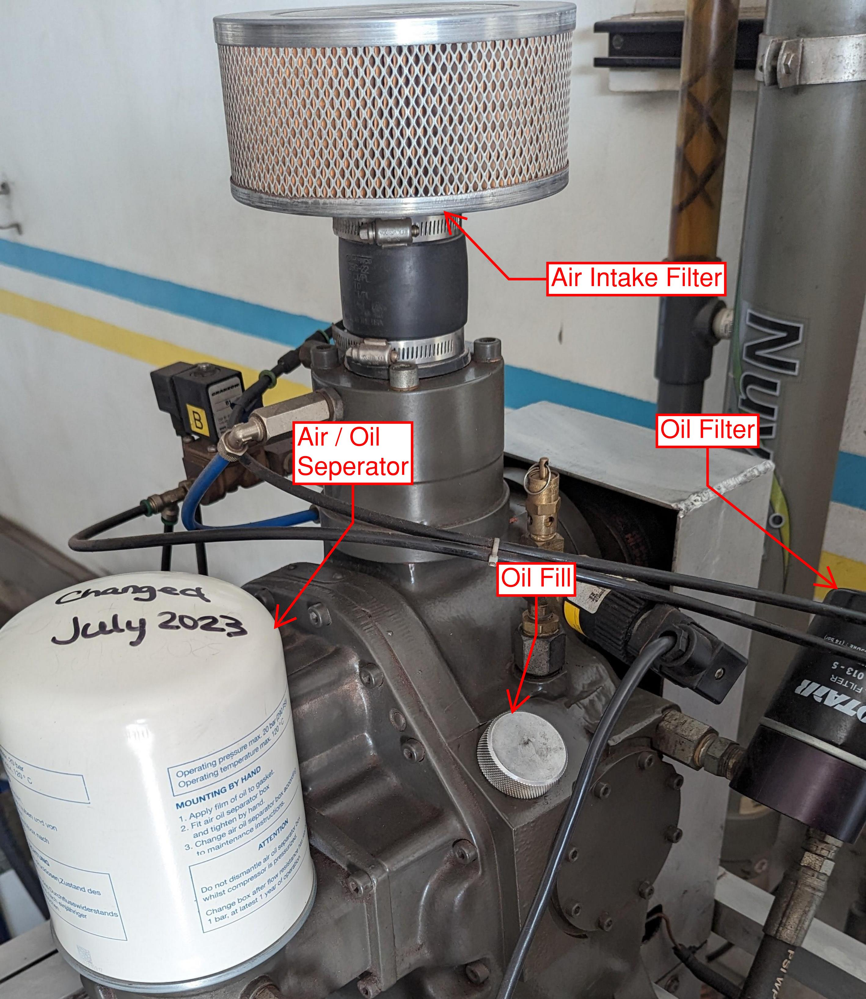
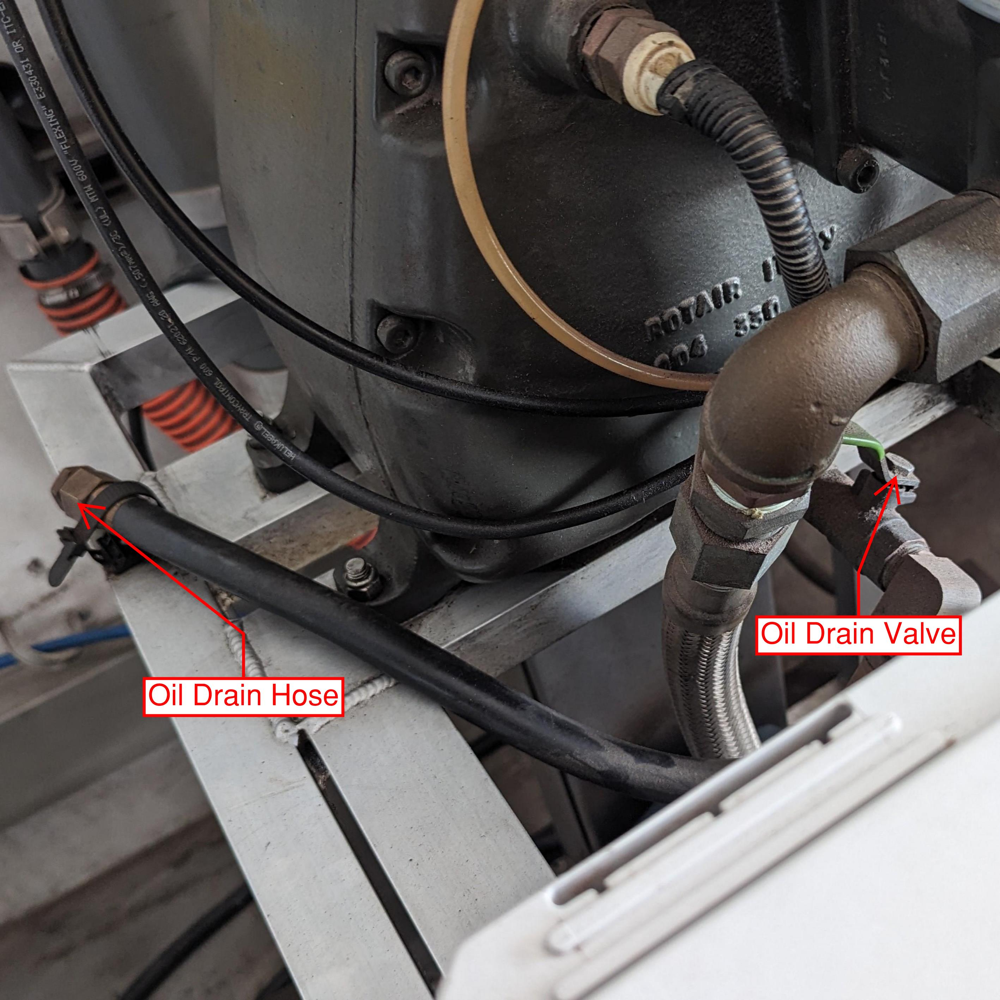

# SOP: Compressor Maintenance

## Purpose

This SOP outlines the procedures for routine maintenance of the compressors used at Sea Saba. Regular maintenance ensures the safe and efficient operation of our compressors and extends their lifespan.

## Scope

This SOP applies to all dive staff responsible for compressor maintenance. It includes instructions for changing air filters, conducting oil changes, and performing other routine maintenance tasks.

## Services

### Final Air Filters (Lawrence Factor X65247)

1. **Frequency of Change**:
    - Change filters every 30 hours of run time.

2. **Procedure**:
    - Filters are numbered 1 (right) and 2 (left); air flows into filter 1, then 2, then to the panel.
    - Depressurize the system using the bleeder to the left.
    - Open filter housings with a wrench. Excessive force indicates pressure in the system.
    - Discard the filter from housing 1; move the filter from 2 to 1.
    - Install a new filter into housing 2.
    - Clean threads on caps, apply silicon grease to O-ring if needed, and reinstall caps without overtightening.
    - Notify when down to 5 filters for reordering.

!!! alert
    When new filters arrive, mark the current inventory with an "X" for differentiation. Use marked filters first.

### Maintenance of the Nitrox Machine

!!! alert
    Refer to the maintenance manual for detailed procedures and safety precautions before starting any maintenance tasks.

1. **Annual / 500 Hours Maintenance**:
    - Change air/oil separator annually, oil and oil filter every 500 hours.
    - Drain old oil using a suitable container.
    - Remove and replace oil filter.
    - Refill with Nuvair 546 Oil.

2. **Every 200 Hours**:
    - Change air intake filter and blue filters.
    - Note hours on new air intake filter with a marker.
    - Change blue filters sequentially:
      - Silver E7-20 (1 micron).
      - Red E5-20 (0.1 micron).
      - Green E1-20 (0.003 ppm oil vapor).
    - Inspect bowls and elements for moisture and degradation.
    - Lubricate new filter O-rings before installation.
    - Clean housing interiors before reassembly.

!!! note
    Change one blue filter at a time to maintain correct order.

3. **Inventory Notification**:
    - Notify management if only one filter is remaining or if there are only two gallons of oil left.

### Maintenance of the Red Compressor

1. **Oil and Filter Change**:
    - Change oil and filter every 90 hours.
    - Drain oil using a suitable container.
    - Replace oil filter; keep spills to a minimum.
    - Refill with Secolube Tropics oil.

!!! note
    Hand-tighten the oil filter only to avoid difficulties in future removal.

2. **Long-Term Maintenance**:
    - Service intervals at 1000 and 2000 hours are performed by Chad.
    - Notify management when these services are due.

## Conclusion

Adherence to this SOP is essential for the upkeep and longevity of our compressors. Regular maintenance ensures operational efficiency and upholds safety standards.

!!! warning
    Working with compressed gas and maintaining breathing air systems involves inherent risks. Improper handling, usage, or maintenance can lead to serious injury or death. Adhere to safety protocols:

    - Follow established SOPs and manufacturer guidelines.
    - Use correct tools and equipment.
    - Wear appropriate PPE.
    - Report any issues immediately.
    - Be familiar with emergency procedures.

    Safety and quality of air are paramount. Your diligence in maintenance is crucial for safety and operational efficiency.
