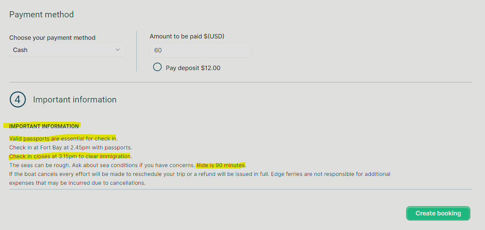
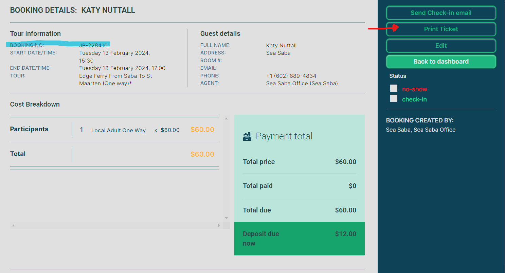

# How to Book Edge Tickets

!!! alert
    **This SOP is no longer valid as Sea Saba no longer sells Edge Tickets.**

### 1. Accessing Junglebee Booking Platform
1.1 Open a Chrome Web Browser.

1.2 Navigate to <https:/junglebee.com> 

1.3 Ensure that Chrome has the login information saved for easy access.

1.4 Once logged in, familiarize yourself with the dashboard layout. Starred options are frequently used and readily accessible.

### 2. Booking Ferry Tickets

2.1  Inquire with the customer regarding their preferred travel direction: St. Maarten to Saba or Saba to St. Maarten.

2.2 Select the appropriate route based on customer preference (e.g., Saba to St. Maarten).

2.3 Choose the desired travel date from the available options. Note the color codes: YELLOW indicates nearing capacity, RED indicates limited space, and GREY signifies sold out or canceled trips.

>Verify if customers are eligible for local pricing, requires a SABA/SXM ID Card **NOT** a passport.

### 3. Passenger Selection and Pricing

3.1 Specify the number of passengers traveling.

3.2 Adult fares (14yrs and above) are $75 for Tourists and $60 for locals.

3.3 Child fares **Must be booked with an Adult**:

  - Ages 5-13: $38 for Tourists and $30 for Locals
  - Ages 0-4: $25 for both Tourists and Locals

### 4. Passenger Information and Contact

4.1 Enter passengers' first and last names exactly as they appear on their passports/ID cards.

4.2 Provide a means of contact ***(email/phone)*** for communication purposes.

4.3 If multiple passengers are traveling, enter their names in the special notes section. For children, include their ages next to their names.

### 5. Payment Method

5.1 Leave the Payment method as **CASH**

5.2 Enter the total ticket amount.

### 6. Confirming Booking

6.1 Review all information for accuracy.

6.2 Click on "CREATE BOOKING".

6.3 Confirm the booking in the pop-up window by verifying details and clicking "Confirm Booking"

### 7. Booking Confirmation

7.1 Upon confirmation, a Booking Number (JB#) will be generated. Copy this number.

7.2 Print the ticket for the customer.

### 8. Processing Payment on Checkfront

8.1 Switch to Checkfront and click on the "Booking" Tab.

8.2 Select "New Booking"

8.3 Choose the "Edge Ferry" tab and select the correct travel date on the Calendar.

8.4 Specify the travel direction and passenger type (Local or Tourist).

8.5 Select the number of passengers and click "Continue".

8.6 Enter the passengers' names and contact details, and click "Continue".

8.7 On the right side of the booking there is a little note box, paste the JB # in here, check the box "Show on invoice", click "Create".

8.8 If paying by card, use the Stripe card reader. If paying with cash, select the "POS" tab and ensure "Cash" is selected.

8.9 Click "Process" to receive payment this will mark the booking as paid.

### 9. Cash Payment Processing (If Applicable)

9.1 In Shopify, navigate to the "More" tab and select "Register".

9.2 Click on "View Open Session" and then "Add Cash".

9.3 Enter the amount of cash received and include the customer's name in the notes for reference.

9.4 Click "Save" to finalize the transaction, and add the cash to the register.

>**NOTE:** Putting the customers name in the notes helps management with tracking payments, and accurate reporting.