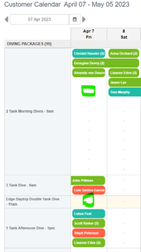

# Checkfront Bookings

## Purpose

To provide step-by-step instructions for using Checkfront to manage bookings, process payments, and handle waivers.

## Scope

This SOP applies to all Sea Saba staff members involved in booking, customer service, and payment processing.

## Procedure

### Logging In

1. **Go to Checkfront**: [https://login.checkfront.com/u/login](https://login.checkfront.com/u/login)
2. **Enter your credentials**: Use your login credentials to log in.

> Tip: If you do not have login credentials, talk with management.

### Navigating the Dashboard

1. **Main dashboard**: Upon logging in, you'll be directed to the main dashboard.
2. **Calendar view**: Select "Calendar" > "Customer View" for a comprehensive view displaying 4 weeks of bookings categorized by type.
3. **Color codes**: Different colors represent various booking types, providing quick visual references.

### Searching for a Booking

1. **Click the search icon** in the top right corner of the dashboard.
2. **Search by last name** for best results when finding a specific booking.

### Creating a New Booking

Two options are available:

1. **"+" Button method**: Click the "+" button on the desired day and activity. Great for single-day activities like Snorkeling or Sunset Cruises.
2. **"New Booking" tab method**: Navigate to the "Booking" tab and select "New Booking". Best for multiple days of different activities.

### Adding Booking Details

1. **Set the end date** and the number of people after selecting the activity.
2. **Click "Continue"** to proceed.

### Guest Information

1. **Input the guest's name and email** (used for receipts and communication).
2. **Add more items**: Click "Add to Booking" on the left side above the calendar if needed.
3. **Click "Continue"** once all details are added.

### Payment Processing

1. **Review the booking**: The next page offers an overview.
2. **Process payment**: Click "Add Payment" underneath the calendar on the left.

#### Credit Card Payments

- **Retail shop**: Change "Card" to "NEW CARD" and enter card details manually.
- **Harbor office**: The "Card" box reads "Harbor Office".

#### Cash Payments

1. **Choose "POS"** and select payment type as "Cash".

!!! warning
    Cash must be in exact change — we cannot use cash from the drawer. It will make your drawer count off at the end of the day.

!!! note
    Put the cash with a note paperclipped to it with the customer's name, or put it in an envelope with the customer's name and place it in the safe.

### Completing the Booking

1. **After processing payment**, the system captures and sends the guest an emailed receipt.

### Waivers and Documents

1. **Guest waivers**: Guests must complete required waivers for their booked activities.
2. **Use the iPad** (in the Retail Shop) with Chrome to access the "Document Directory".
3. **Click "Sign Document"** for the activity they booked.

### Attaching Waivers to Bookings

1. **Access the booking** on the computer once the waiver is signed.
2. **Click the "Document" tab**, then "Attribute Documents".
3. **Search for the signed document** and select the relevant names.
4. **Click "Attach"** to associate the waiver with the booking.
5. **Repeat** for multiple guests if necessary.

## Accountability

All staff members handling bookings are responsible for following this SOP. Ensure all payments are processed correctly and waivers are attached to bookings before the guest's activity date.

