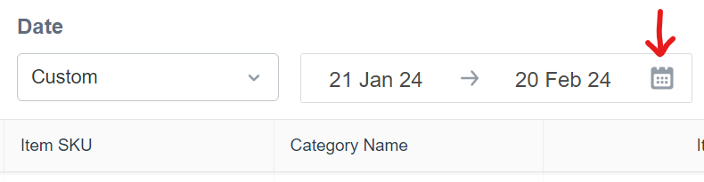
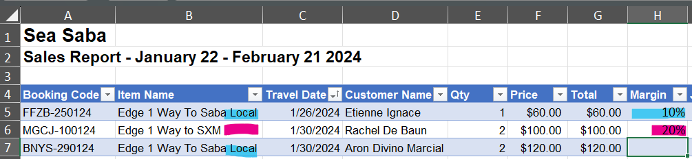

# Running Edge Weekly/Monthly Reports
### 1. Accessing Checkfront:
  - Open Checkfront https://seasaba.checkfront.com/
  - Navigate to the Reports tab.
  - Select "Booking Sales".
  - Ensure that the "Booking Item" tab is selected.
  - Change the "Date Source" to "Start".
  - Change the "Date" to "Custom".
  - Select the desired date range.
  - Ensure the "Item ID" has the 4 "Edge 1-ways" selected.
  - Click on the Export icon.

### 2. Excel Formatting:
  - Open the Excel sheet (if not opened automatically).
  - Click on "Enable Editing" at the top.
  - Delete columns: B, D, E, I, and J
  - Rename cells:
    - "Item Start Date" change to "Travel Date"
    - "Item Quantity" change to "Qty"
    - "Net Sales" change to "Price"
  - Name new cells:
    - H4 name "Margin"
    - I4 name "JB#"
    - J4 name "Commission"
    - K4 name "To Edge"
    - L4 name "Notes"
  - Format Columns:
    - Change column C to "Short Date" format
      - You will have to type in the date MM/DD it will not automatically change.
    - Change columns F, G, J, and K to "Currency" format.
      - I like to select the "More Number Formats" and select the Currency option with the negative numbers being in RED so they stand out.
    - Change column H to "Percentage" format.

### 3. Insert Table and Sorting:
  - Select the report from row 4 until the end and insert a Table, ensuring to check the box "My Table Has Headers".
  - Sort table data by "Travel Date".

### 4. Adding Formulas:
  - In "Margin" column, input 10 if the "Item Name" says "Local", otherwise input 20.
  - In Price (F5), input the formula =G5/E5. Or if you are clicking on the cells, it should read =[@Total]/[@Qty]
    - You will need to grab the little green square and drag the formula down the rest of the column.
  - In "Commission" (J5), input the formula =G5*H5. If you type enter when done with the formula it will automatically continue the formula through the rest of the columns
  - In "To Edge" (K5), input the formula =G5-J5.

### 5. Adding JB#'s and Adjustments
  - Obtain JB#'s from Checkfront or Junglebee, copy and past the numbers into the corresponding cells

  - Insert 3 rows after row 3.
  - Merge the following cells:
    - F1-G1 down to F5-G5
    - H1-I1 down to H5-I5

### 6. Adjusting Font and Formatting for the Top:
  - Select the entire sheet
  - Change the font to Arial or Calibri and size 12.
  - Bold the header cells (F1-I1 down to F5-I5).
  - Set formatting for specific cells at the top:
    - F1 type "Days Running"
    - F2 type "Agent Fees"
    - F3 type "Commission
    - F4 type "To Edge"
    - F5 type "Total Sales"
    - H1 change number format to "General"
    - H2-5 change number format to "Currency"
    - H2 type formula =H1*40
    - H3 type formula =sum(J:J)
    - H4 type formula =sum(K:K)
    - H5 type formula =H3+H4

### 7. Counting Days and Verification:
  - Count the days the Edge Ferry ran to Saba and enter the number in H1.
  - Verify received payment for all purchased tickets.
  - Cross check report with Aqua Mania's report they send over.

### 8. Saving the Report:
  - Save the Excel sheet in One Drive>08 Edge Ferry>YYYY Bookings>MM Mon YYYY, Naming the file with dates of travel.

#### By Following these steps, you can efficiently run Edge Reports and ensure accurate data for analysis and record-keeping.