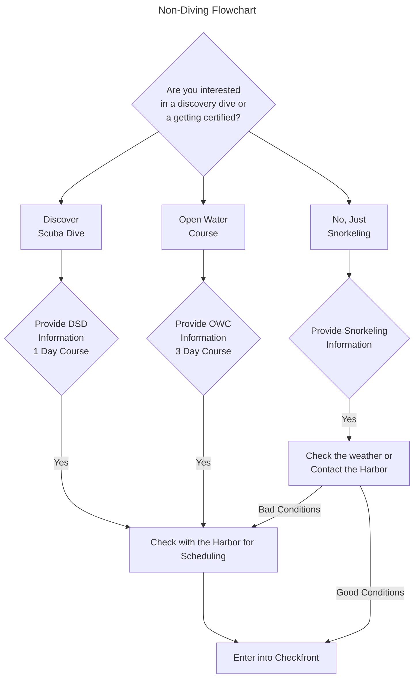

# Non-Diving Flowchart

A visual decision tree for staff to guide non-certified guests toward the appropriate activity — Discover Scuba Diving, Open Water Course, or Snorkeling.

```mermaid
---
title: Non-Diving Flowchart
---
graph TD;
    start{Are you interested<br>in a discovery dive or<br>a getting certified?}
    start --> dsd[Discover<br>Scuba Dive]
    start --> owc[Open Water<br>Course]
    start --> snorkel[No, Just<br>Snorkeling]

    dsd --> info1{Provide DSD<br>Information<br>1 Day Course}

    owc --> info2{Provide OWC<br>Information<br>3 Day Course}

    snorkel --> info3{Provide Snorkeling<br>Information<br>}

    info1 --Yes---> Harbor[Check with the Harbor for Scheduling]

    info2 --Yes---> Harbor
    info3 --Yes--> Weather[Check the weather or<br>Contact the Harbor]
    Weather --Bad Conditions--> Harbor
    Weather --Good Conditions---> Checkfront[Enter into Checkfront]
    
    Harbor ---> Checkfront
```